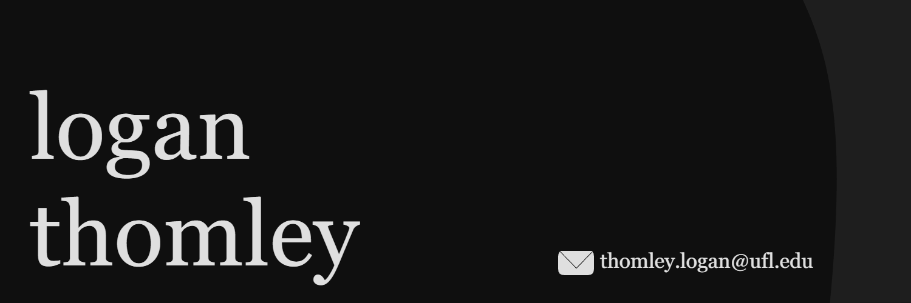

---
*About me:*
- 🏫 Second-year majoring in **computer science** with a minor in **statistics** @ Univ. of Florida
- 💻 Interested in deep learning, computer vision, and robotics
- 🧪 NLP Undergraduate Research Assistant @ [MELD](https://meld.lin.ufl.edu/about/) Lab
- 🔬 Applied Research Lead @ [GATR Robotics](https://github.com/GATR-VEX)  
- 🤖 Founded #1 Ranked HS [Robotics Team](https://www.youtube.com/watch?v=roouqoDrFIo&t=1s) (1/20,000+ globally)
---
*Currently Building:*
- 📊 [SHEATH-DL](https://github.com/LThmly/SHEATH-DL.git) - Deep Learning Library for C++
- 👓 Smart Glasses w/ Wake Word Detection
- 🔍 SwampSearch - Platform connecting **Students** to **Research Labs**
---
*Contact:*
<!--  -->
- Connect with me on [LinkedIn](www.linkedin.com/in/loganthomley)!
