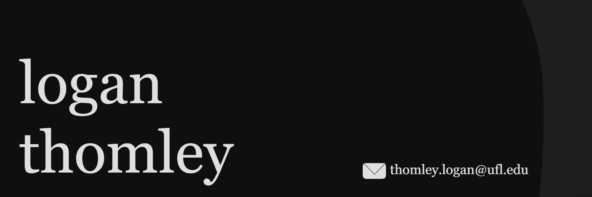

---
*About me:*
- 🏫 Second-year **Computer Science** major, **Statistics** minor @ University of Florida
- 💻 Interested in deep learning, computer vision, and robotics
- 🧪 NLP Undergraduate Research Assistant @ [MELD](https://meld.lin.ufl.edu/about/) Lab
- 🔬 Applied Research Lead @ [GATR Robotics](https://github.com/GATR-VEX)  
- 🤖 Founded #1 Ranked HS [Robotics Team](https://www.youtube.com/watch?v=roouqoDrFIo&t=1s) (1/20,000+ globally)
---
*Currently Building:*
- 📊 [**MYELIN**](https://github.com/LThmly/MYELIN.git) - Deep Learning Library for C++
- 👓 **Smart Glasses** w/ wake word detection
- 🔍 **SwampSearch** - Platform connecting **students** to **research labs**
---
*Contact:*
<!--  -->
- Connect with me on [LinkedIn](https://linkedin.com/in/loganthomley)!
